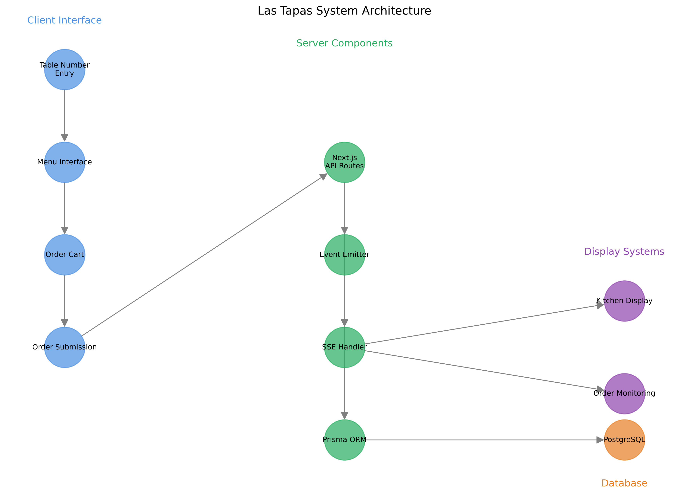

# Las Tapas Digital Menu System
**PRIVATE & CONFIDENTIAL**  
*Property of Las Tapas Company*

## Overview
The Las Tapas Digital Menu System is a modern, interactive web application designed to streamline the ordering process in Las Tapas restaurants. The system enables customers to browse menu items, place orders, and tracks order fulfillment in real-time.

## System Architecture



## Core Components

### 1. Customer Interface
- **Table Number Entry** (`app/page.tsx`)
  - Initial entry point for customers
  - Validates table numbers
  - Redirects to menu interface

- **Menu Interface** (`app/menu/page.tsx`)
  - Displays all available dishes
  - Interactive category filtering
  - Real-time order management
  - Allergy information display

- **Order Management** (`app/components/OrderForm.tsx`)
  - Shopping cart functionality
  - Order modification
  - Real-time order submission

### 2. Server Components
- **API Routes**
  - `/api/submit-order`: Handles order submission
  - `/api/submissions`: Retrieves order history
  - `/api/sse`: Manages real-time updates

- **Event System**
  - Real-time order notifications
  - Kitchen alert system
  - Order status updates

### 3. Database Schema
```prisma
model Order {
  id          Int         @id @default(autoincrement())
  tableNumber Int
  createdAt   DateTime    @default(now())
  items       OrderItem[]
}

model OrderItem {
  id       Int    @id @default(autoincrement())
  orderId  Int
  order    Order  @relation(fields: [orderId], references: [id])
  dishId   Int
  dishName String
  quantity Int
}
```

## Features

### Menu Management
- Dynamic category filtering
- Subcategory support for beverages
- Allergy information display
- High-quality dish images
- Responsive design

### Order Processing
- Real-time order tracking
- Table-based ordering
- Multiple item support
- Order modification capabilities
- Instant kitchen notifications

### Monitoring System
- Order history tracking
- Real-time order updates
- Kitchen display integration
- Table status monitoring

## Technical Stack
- **Frontend**: Next.js 14, React 18
- **Backend**: Next.js API Routes
- **Database**: PostgreSQL with Prisma ORM
- **Real-time Updates**: Server-Sent Events (SSE)
- **Styling**: CSS Modules, Tailwind CSS
- **Image Optimization**: Sharp
- **Type Safety**: TypeScript

## Security Features
- Environment variable protection
- Database connection pooling
- SQL injection prevention
- XSS protection
- CSRF protection

## Development Setup

1. Clone the repository (requires access)
2. Install dependencies:
```bash
npm install
```

3. Set up environment variables:
```bash
cp .env.example .env
```

4. Initialize database:
```bash
npx prisma generate
npx prisma db push
```

5. Start development server:
```bash
npm run dev
```

## Deployment

The application is configured for deployment on Vercel with the following considerations:
- PostgreSQL database hosted on Neon
- Automatic preview deployments
- Production environment protection
- Database connection pooling

## Performance Optimizations
- Image optimization with Sharp
- Dynamic imports
- Route prefetching
- CSS optimization
- Database connection pooling

## License
This software is proprietary and confidential. Unauthorized copying, transferring, or reproduction of the contents of this system, via any medium is strictly prohibited.

Copyright © 2024 Las Tapas Company. All rights reserved.